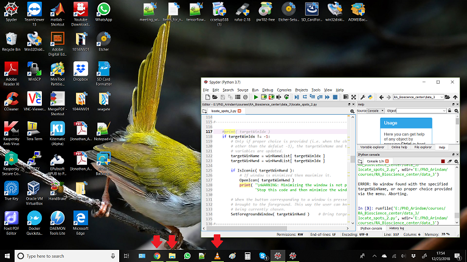
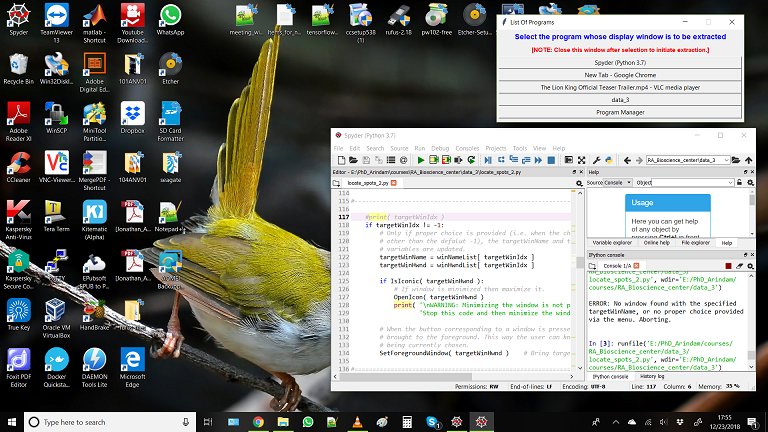

# Objective: 
The objective of this project is to be able to extract the scene or the content inside any active window of any program, into an opencv image or video. 

**A *Trailer* of Final Result:**

[**YouTube Link to Full Video**](https://youtu.be/0WNfKg60dAc)

---

In other words, anything that is shown inside the display window of a program, should be visible inside an opencv window as a numpy array.

The motivation of this project comes from various sources. Some of them are as follows: 

[**NOTE:** These also shows the potential application of the final code created at the end of this project.]

* There may also be some process running in a program window and we want to record the scene by scene changes of the process as shown in the window.
* Suppose the user is playing a computer game and wants to record the game like a movie as he plays it (some game software might have this option built in, but not all).
* Suppose the user wants to create a visual tutorial of some process or installation.
* There are often videos shown in the internet that are not available to record.
* Taking screenshot of only the display inside an opened window and not anything else visible in the neighboring region in the desktop.
* Suppose the user wants to do some kind of image processing on the scenes shown inside a program window.

These above aspects can be resolved if there is a code or a script such that the user will specify the name of the desired window (whose scene is to be extracted) and the code will display the scene as a numpy array in an 
opencv window.

# Requirements: 
* This application is should be created to run of a **Windows 10** machine.
* The user can specify the name of any window that is currently running.
* If the window is not running, there should be a graceful exit.
* If window is minimized, then the code should automatically maximize the target window.
* There should be a functionality to record the displayed images as a video as well.

# Current Framework: 
* Opencv libraries, Windows 10, Python 3.6.3 (Anaconda), Spyder framework (optional).
* PIL and ctypes packages of Python.

# Overview of the Script:
This describes the overall process of how this [python script](codes/capture_window.py) make use of the ctype functions to capture the scene inside the target window.

At first a **Menu** window is created as a gui using **tkinter** package that lists all the visible opened window available. There are some windows detected whose name are just empty strings, these are ignored.
This gui serves as a menu. There is a **button** for each of the windows available. If one of these button is pressed then the corresponding window is maximized and brought to front.
After this if the menu is closed then this window name is updated in a variable called **targetWinName** indicating that this is the desired window whose display is to be extracted.

The **targetWinName** variable contains the name of the window that is to be captured.
The entire code runs in a while loop continuously unless the user closes the opencv display window (by pressing **ESC**) or closes the actual target program window. These are the only two cases by which the code stops.

In windows, all the program windows have a **window handle object** (which is like a pointer) associated with the window. This is not fixed for the program. If the same program is closed and reopened again, it may have a different handle the second time.
But if this handle object can be accessed, then there are lot of **ctype** functions that can be used to do a number of processing on features of the window itself and also with the content of the window.

The while loop of the code always keeps some lists, **titles**, **hwndList**, **windowRect**, to keep track of the title, the handle object and the coordinates of the box of the target window that is to be captured.

These lists are regularly updated using a separate internal thread, by a callback function (**foreach_window**).
This callback function is created using the **ctype** functions called **EnumWindows** and **EnumWindowsProc**. 
Some help forums describing these functions can be found in this [**link**](https://sjohannes.wordpress.com/2012/03/23/win32-python-getting-all-window-titles/).

The foreach_window function accesses all the opened and visible windows (using the ctype function **IsWindowVisible**) with their respective handles and checks if the name of the window matches the targetWinName or not.

If a match is found then the window is first maximized (using the ctype function **OpenIcon**) and then the rectangle which is bounding this window is extracted using **GetWindowRect** function.

These are all stored into the lists (mentioned earlier) and they are accessed by local variables inside the main function inside the while loop from these lists.

They are then displayed inside an opencv window as a numpy array. These images can also be recorded as the frames of a video.

Provision has been made such that the code will stop automatically if the target window is closed. And once the target window is found, the code using the ctype function **IsIconic** checks if the window is minimized or not and prevents the user from accidentally minimizing it.

# Results:
The following images are the snaps of the different stages when the code is run.

#### Open script using Spyder:
The code is run using **Spyder**. Before the code is run, there should be some program windows which are visible either is maximized or minimized form. 
In this snapshot, a **VLC** player, a **Chrome** window and a folder called **data_3** is visible in minimized form (These are shown by the **RED** arrows).

#### Run the script:
Once the script is run, the **Menu** window opens. This has the buttons for each available visible window. There may be some windows listed which are not visible as they are run by the windows os in background.
Since the user has not selected any program yet, so all the buttons are in **Released** position right now.

